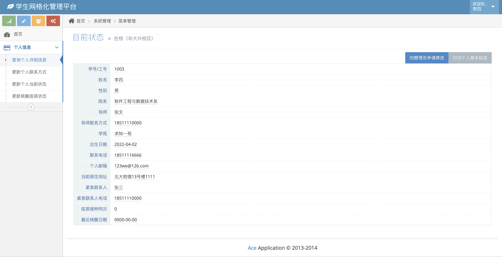
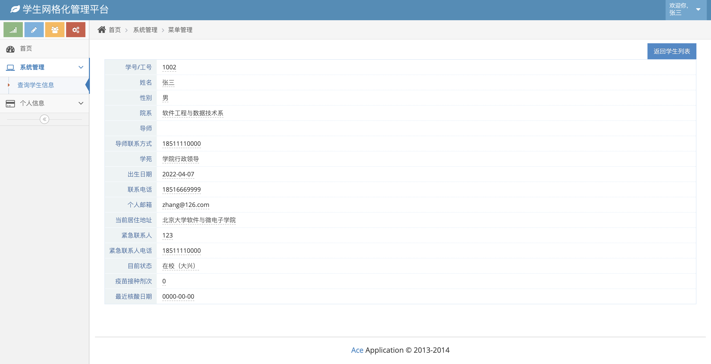
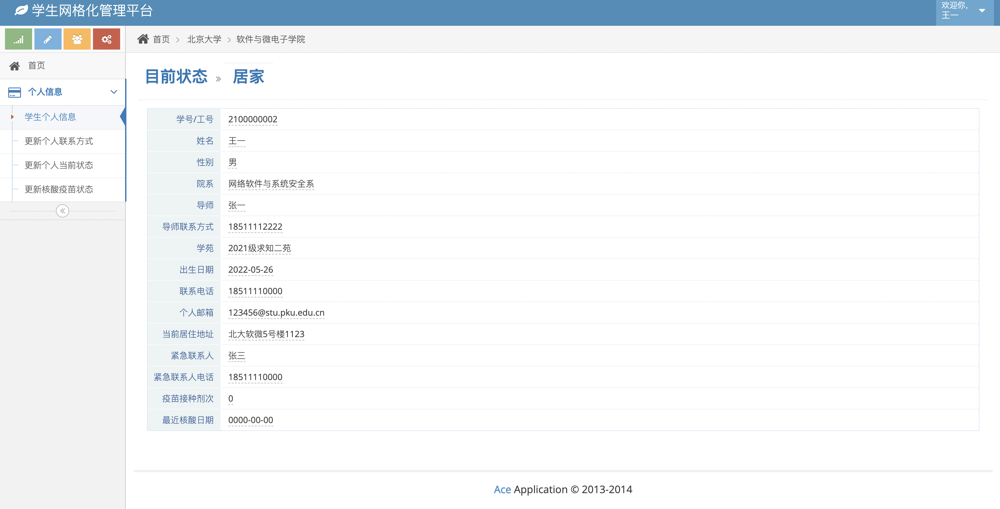
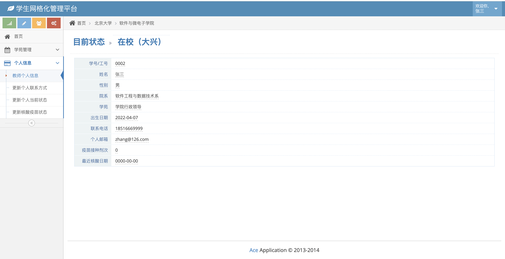
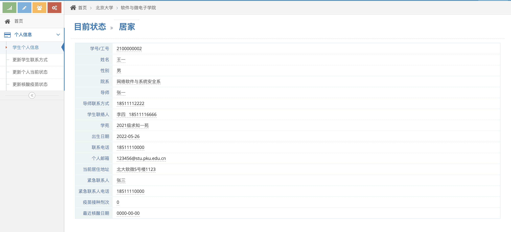
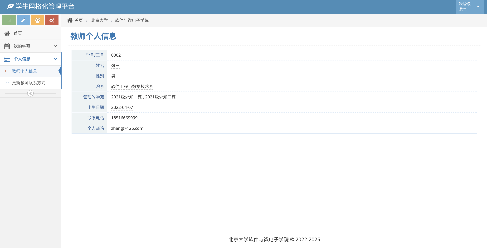
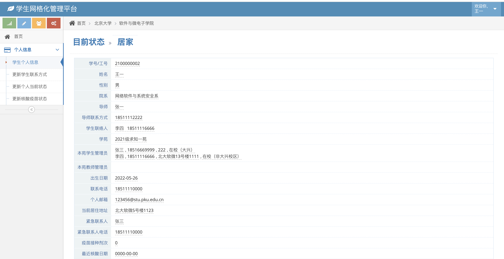

# 功能需求10的开发说明

## 第一周进度

### 前端页面截图：

更新学生查看个人信息界面

更新教师查看学生详细信息界面

## 第二周进度

### 前端页面截图：

更新学生查看个人信息界面

更新教师查看个人信息界面

## 6.23进度

### 前端页面截图：

更新学生查看个人信息界面  新增学生联络人字段+非空判断

更新教师查看个人信息界面  新增教师管理学苑字段

更新学生查看个人信息功能，新增学生学苑管理员、教师学苑管理员字段