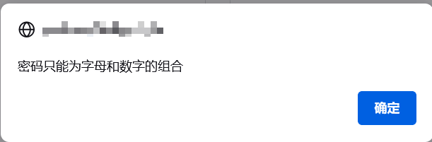
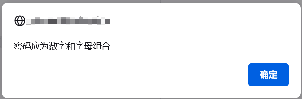
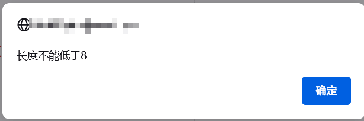
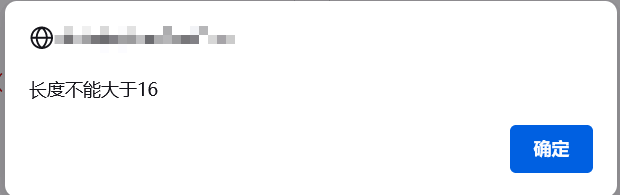

##功能介绍

###前端：检验输入框输入内容合法性
- 相关文件：public/static/js/checkInput.js 
- 具体功能：检查输入内容长度、是否为纯数字、是否符合邮箱地址规范、是否符合手机号码规范、是否符合密码英文数字混合规范
- 使用方法：详见public/static/js/checkInput.js
- 截图





###后端：检验存入数据库数据的合法性
  - 相关文件：application/index/validate 文件夹中所有文件
    - 具体功能
      - RbacUser.php：检查插入RbacUser表中的数据是否合法
      - UserInfo.php：检查插入Log表中的数据是否合法
      - 其他以此类推
      - 使用方法：以RbacUser数据表为例，要验证插入数据表RbacUser的数据是否合法，则使用以下代码
        ```injectablephp
        $validate = Loader::validate('RbacUser'); 
         if(!$validate->check($data)){
         dump($validate->getError());//这里是打印出错误信息，可以根据需要更改
        }
      其中，$data应为数组，数组内的变量名和$rule对应， 如RbacUser验证的数据`$data=['username'=>'anyvalue','password'=>'anyvalue']`
      
      - 注意：要检验插入核酸表的数据，应在实例化后，先调用setDateRule()方法，以便对输入的日期信息进行检查：
      ```injectablephp
      $validate = Loader::validate('Hesuan'); 
      $validate.setDateRule();//设置日期检查规则
      if(!$validate->check($data)){
      dump($validate->getError());//这里是打印出错误信息，可以根据需要更改
      }
      ``` 