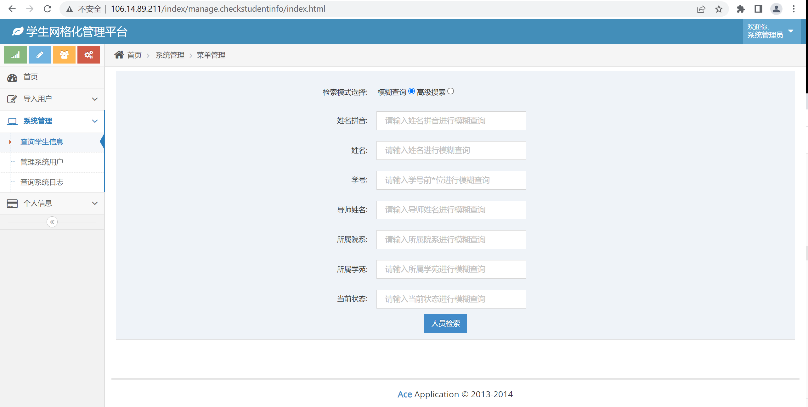
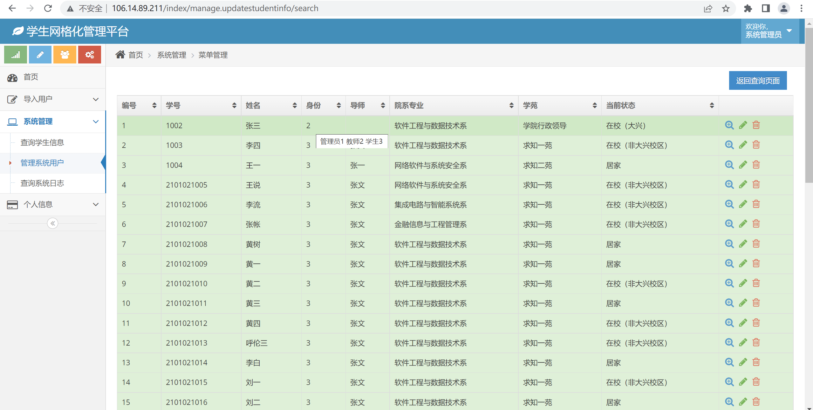
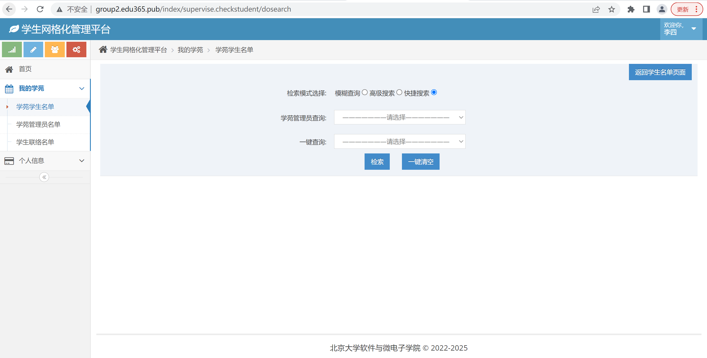
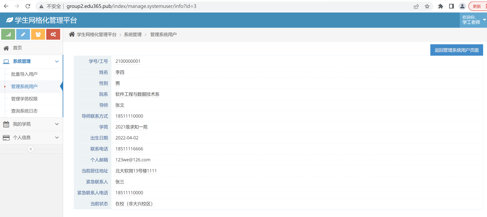

# 功能需求6的开发说明
说明：为了方便老师衡量个人代码，我将我负责的模糊查询部分的代码单独上传至index文件夹（无最新代码），包括涉及的控制器和视图文件（最新代码在课堂派中有说明）
说明：由于第三周的数据库进行了大幅度修改，因此代码全部需要重构

## 第一周进度

### 前端页面截图：

## 第二周进度
### 说明：以下为个人代码部分的运行结果，此部分单独可运行
### 1 教师端
说明：教师可根据姓名拼音、姓名、学号、导师等信息进行模糊搜索

说明：高级搜索模式中，学苑、部门等条件可以多选，同时可以选择核酸日期进行查询

说明：模糊搜索结果展示

说明：高级搜索结果展示

### 2 管理员端
说明：模糊搜索与教师端类似，高级搜索中可以选择多个身份进行搜索

说明：管理员模糊搜索结果

说明：管理员搜索结果中身份一栏有提示信息

## 第三周进度

### 修改说明
* 1、查询核酸日期时，显示的为未做核酸的学生名单
* 2、可以查询每个学苑的管理员
* 3、可以直接查询未更新个人信息同学名单
* 4、可以一键查询当日未做核酸人员名单
* 5、不同学生管理员或教师管理员只能查询所管理的学生

## 第四周进度
### 1 超级管理员
* 1、增加一键清空搜索条件的功能

* 2、显示的表单新增联络人字段

* 3、增加分页功能

* 4、管理首页显示管理的全部用户

* 5、快捷搜索逻辑调整，可以选择某苑进行一键查询（AND条件）

### 2 教师管理员及学生管理员
* 1、表单新增联络人字段(同上)
* 2、增加分页功能(同上)
* 3、重新设计学生名单界面：首页显示管理的学苑、可选择不同学苑和不同状态显示、可跳转到查询界面
* 4、将删除功能移除
* 5、检查URL跳转

### 3 后续工作计划
* 1. 教师管理员界面新增一键删除
* 2. 教师管理员高级搜索界面选项只限于自己管理的学苑
* 3. 将last_hesuan信息显示到首页
* 4. 在首页新增一键显示当日未作核酸名单

## 第五周（最终进度说明）

### 解决的问题/进行的修改
* 1. 教师管理员学苑学生名单查询界面添加了一键清空

* 2. 教师/学生管理员下拉和高级检索界面只限自己学苑/将last_hesuan信息显示到首页

* 3. 超级管理员点击学苑学生名单时下拉可选择多个学苑/学苑学生名单界面不显示教师

* 4. 学苑学生名单快速搜索支持选择学苑

* 5. 点击放大镜时学生和教师不同界面
* 5.1 教师界面

* 5.2 学生界面

## 代码说明（查询部分）
1. 页面说明
* 教师/学生管理员端
---
--分割线，以下是初始信息---
* 第一部分是搜索界面，学工老师可以通过姓名拼音、姓名、学号、所属院系、导师姓名、所属学苑、当前状态查询学生
---拼音、姓名、学号是模糊查询，其余是精确查询
* 后台会对输入的信息进行检测
---若为空，第二部分提示请输入信息
---若有结果，第二部分显示为表格
---若无结果，第二部分显示为无结果提示信息
---
---分割线，以下是更新信息---
* 模糊搜索模式，学工老师可以通过姓名拼音、姓名、学号、导师姓名、所属院系、所属学苑、当前状态进行模糊查询
---模糊查询后表格中会显示上述信息，点击查看按钮可以查看单一用户完整信息
* 高级查询模式，学工老师除了可以模糊查询外，可以选择多个所属院系、所属学苑、当前状态和核酸日期进行查询
---查询结果会显示核酸检测时间和地点
---表格会自动编号，方便学工老师统计人数
* 后续工作：修改查询逻辑，可以查询未做核酸的同学
---
* 超级管理员端
---
---分割线，以下是初始信息---
* 第一部分是搜索界面，管理员可以根据姓名拼音、姓名、学号/工号、所属院系、所属学苑、身份、当前状态查询学生或老师
---拼音、姓名、学号/工号、所属学苑是模糊查询，其余是精确查询
---PS：由于一个老师可能属于多个学苑，因此学苑设置为模糊查询
* 后台会对输入的信息进行检测
---若为空，第二部分提示请输入信息
---若有结果，第二部分显示为表格
---若无结果，第二部分显示为无结果提示信息
* 后续添加功能——日志查询
---
---以下是更新信息---
* 模糊搜索模式，管理员可以通过姓名拼音、姓名、学号/工号、导师姓名、所属院系、所属学苑、当前状态进行模糊查询
---模糊查询后表格中会显示上述信息，点击查看按钮可以查看单一用户完整信息
* 高级查询模式，管理员除了可以模糊查询外，可以选择多个身份、所属院系、所属学苑、当前状态和核酸日期进行查询
---查询结果会显示核酸检测时间和地点以及身份信息
---表格会自动编号，方便管理员统计人数
---可以查看、修改与删除信息
* 后续工作：修改查询逻辑，可以查询未做核酸的同学
---

## 搜索功能说明
* 教师/学生管理员端
---初始界面显示搜索界面（搜索范围限于学生）
---搜索后会加载搜索结果的表单
* 超级管理员端
---初始界面显示搜索界面（搜索范围包括教师）
---搜索后会加载搜索结果的表单

## 代码更新
* 1、修改controller
--- group2/ application / index / controller / manage / Systemuser.php
--- group2/ application / index / controller / supervise / Checkstudent.php
* 2、修改view 
--- 路径 group2/ application / index / view / manage / systemuser
---修改初始界面index.html
---修改模糊查询结果界面search.html
---新增显示详细信息界面info.html
---新增高级搜索结果页面advanced.html
---新增查询界面doresearch.html
---新增显示教师详细信息界面teacher.html

--- 路径 group2/ application / index / view / supervise / checkstudent
---修改初始页面index.html
---修改模糊查询结果界面search.html
---修改查看详细信息界面info.html
---新增高级搜索结果页面advanced.html
---新增查询界面doresearch.html

* 3、修改thinkphp/library/think/db
---修改Builder.php，使输入时间能够为空

## 系统建议

* 1. 数据库修改（已采纳）
   - 增加表单
   - 基础表单所属学苑项的修改建议

* 2. 系统教师端（已采纳）
   - 本苑学生名单一项修改为学生名单，因为一个教师可能管理多个学苑

* 3. 数据库（已部分采纳）
   - 建议在数据库user_info表中多增加一些数据(例如100个)，方便测试；
   - user_info表中no字段名称改为num，使得字段含义更加清晰
   - 在测试时添加pinyin字段（因为有些多音字无法判断，比如吴茜，这个字可以读"xi",也可以读"qian",但系统无法判断到底读哪一个，需要本人在填报时输入拼音字段，这样能够防止模糊检索wx时搜不到wuqian）

* 4. 核酸填报
   - 在填报核酸信息功能界面可选日期或许应该截至填报当天，防止用户输入未来的时间导致无效信息

* 5. Common.php文件 (已修改)
   - 存在一些错误