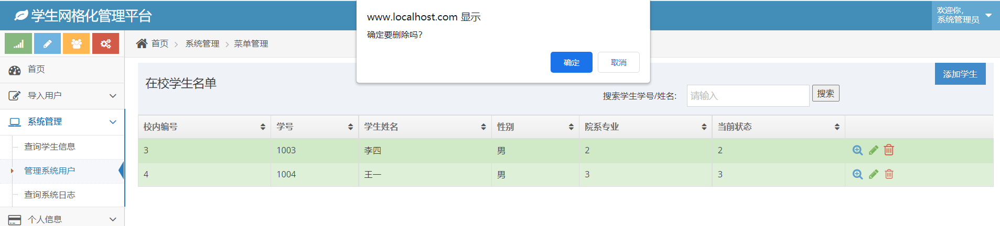
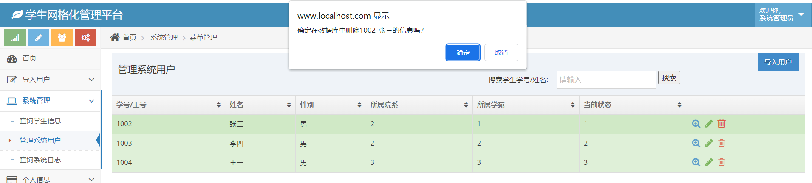
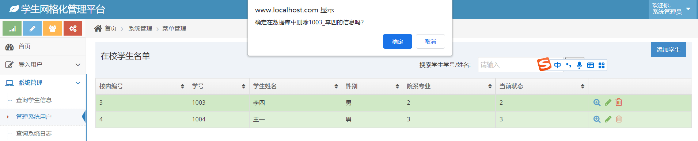
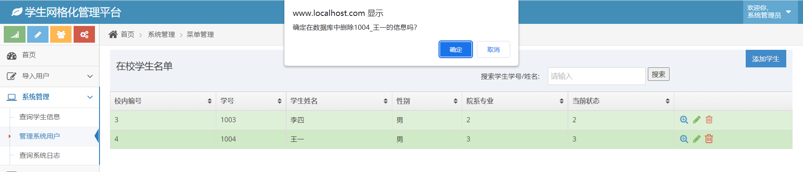
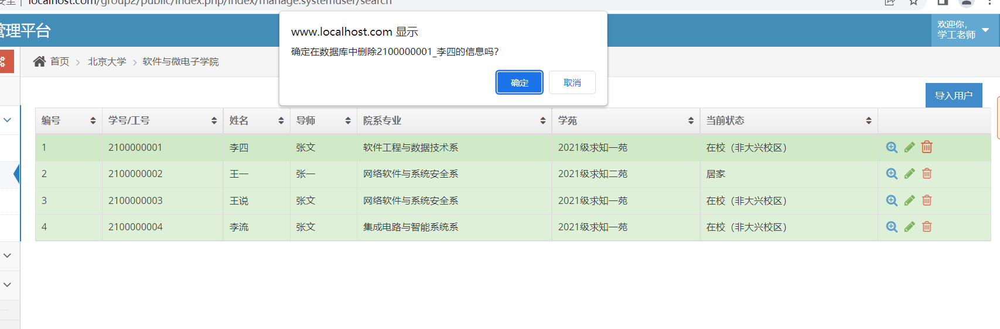

# 功能需求9的开发说明

## 第一周进度

### 前端页面截图：

#### 

实现超级管理员删除学生信息前弹出确认信息框的功能

## 第二周进度

### 前端页面截图：

(a)是否从数据库中删除张三的信息

(b)是否从数据库中删除李四的信息

(c)是否从数据库中删除王一的信息

优化了弹出信息框显示的提示信息，在提示信息中增加了所要删除的用户的具体信息(工号/学号，姓名)

## 最后一周进度

在重构代码页面优化了弹出信息框显示的提示信息，在提示信息中增加了所要删除的用户的具体信息(工号/学号，姓名)

同时追加了超级管理员删除时对 rbac user user info user contact user manage department rbac user has role vaccines
中相关信息的删除

在application/index/controller/manage/Systemuser.php 删除的代码逻辑中追加了非空判断

在application/index/controller/manage/Systemuser.php 删除的代码逻辑中修改为只改动userinfo表，同时对save（）返回值追加判断